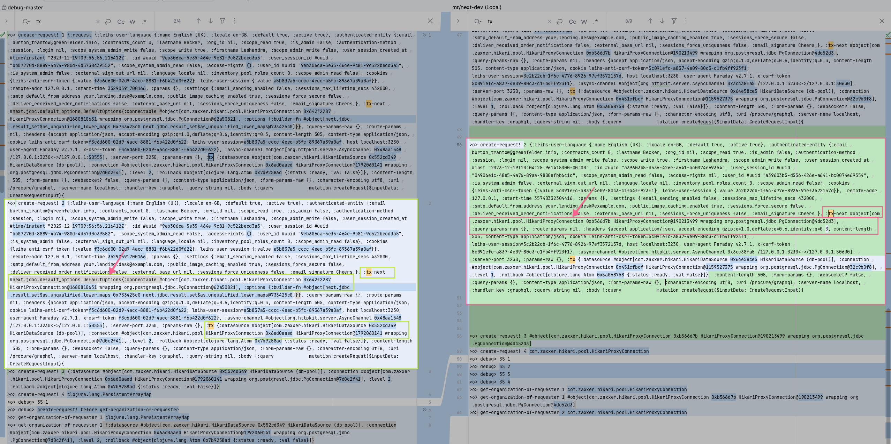

Repos
1. shared-clj: next-honey
2. procure:    mr/next-dev


Test-Setup to reproduce issue
1. Run procure
2. Trigger test within `/procure/server`
   ```bash
   NOPRY_ON_EXCEPTION=no DB_NAME=leihs_test ./bin/rspec  ./spec/graphql/request/request_create_spec.rb:365
   ```
   
Issue: wrong instance in use as tx (? fixed by using `(.rollback (:connectable tx))`)


FYI:
- Used `(.rollback (:connectable tx))` instead of ` (.rollback)`
  Outcome: tx is now type of `>o> get-organization-of-requester 3 next.jdbc.default_options.DefaultOptions`


```bash
a598d6 next.jdbc.result_set$as_unqualified_lower_maps@6a598d6]}}
>o> create-request! 4 next.jdbc.default_options.DefaultOptions
>o> debug> 35 1
>o> debug> ??? 35 2 nil
>o> debug> ??? 35 3 nil
>o> debug> 35 4 user-id= ce11182f-9103-42e8-a32e-8d6169d81bf1
>o> get-organization-of-requester 1 next.jdbc.default_options.DefaultOptions
>o> get-organization-of-requester 2 #next.jdbc.default_options.DefaultOptions{:connectable #object[com.zaxxer.hikari.pool.HikariProxyConnection 0x196ce46 HikariProxyConnection@26660422 wrapping org.postgresql.jdbc.PgConnection@1381ff21], :options {:builder-fn #object[next.jdbc.result_set$as_unqualified_lower_maps 0x6a598d6 next.jdbc.result_set$as_unqualified_lower_maps@6a598d6]}}
2023-12-19T11:36:27.169Z NX-41294 DEBUG [leihs.procurement.resources.requesters-organizations:40] - user-id => ce11182f-9103-42e8-a32e-8d6169d81bf1
2023-12-19T11:36:27.170Z NX-41294 DEBUG [leihs.procurement.resources.requesters-organizations:36] - (-> (sql/select :procurement_organizations.*) (sql/from :procurement_requesters_organizations) (sql/join :procurement_organizations [:= :procurement_requesters_organizations.organization_id :procurement_organizations.id]) (sql/where [:= :procurement_requesters_organizations.user_id [:cast (spy user-id) :uuid]]) sql-format) => ["SELECT procurement_organizations.* FROM procurement_requesters_organizations INNER JOIN procurement_organizations ON procurement_requesters_organizations.organization_id = procurement_organizations.id WHERE procurement_requesters_organizations.user_id = CAST(? AS UUID)" "ce11182f-9103-42e8-a32e-8d6169d81bf1"]

>o> get-organization-of-requester 3 next.jdbc.default_options.DefaultOptions

```


POI's / Modified files
1. Modified jdbc-transition-handling: `server/src/leihs/procurement/graphql.clj::handler`
2. Processing stops during jdbc-execution: `server/src/leihs/procurement/resources/requesters_organizations.clj::get-organization-of-requester`
